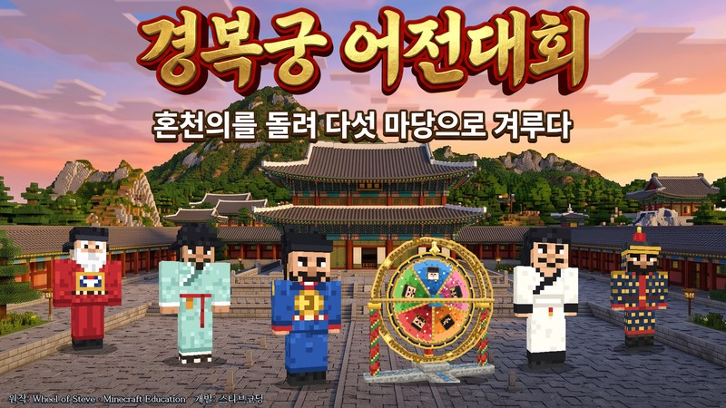
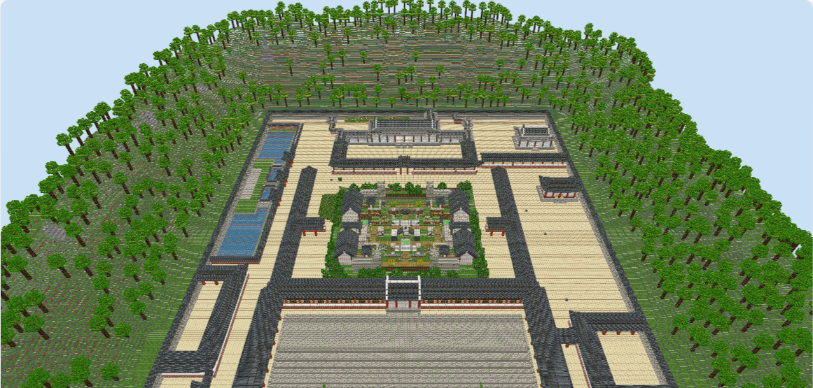
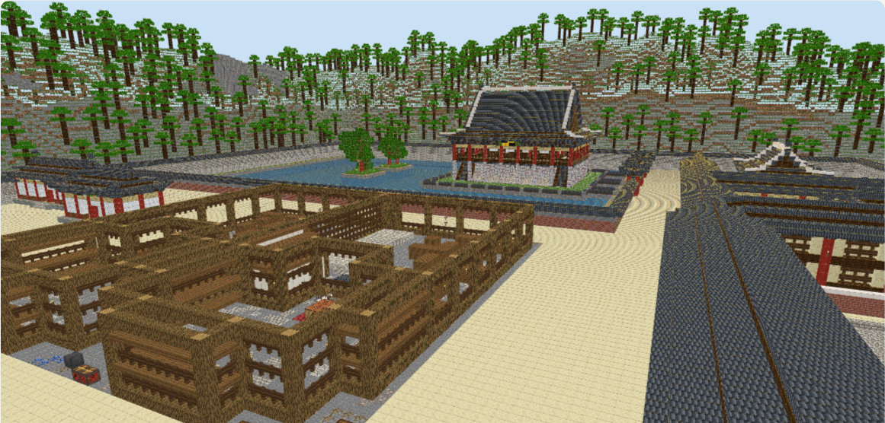
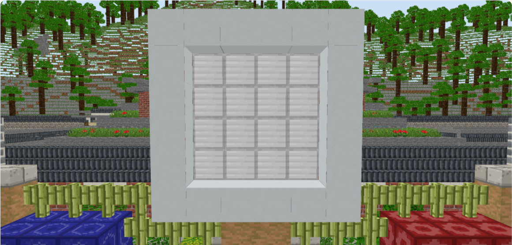
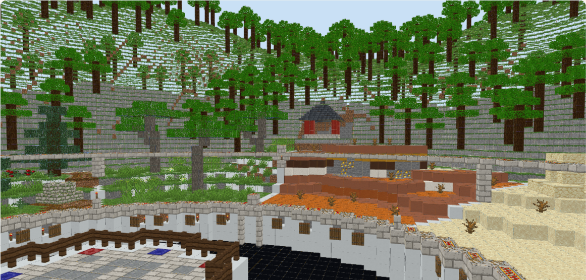
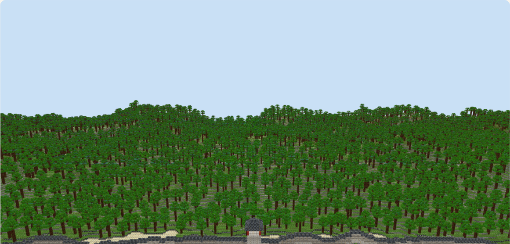
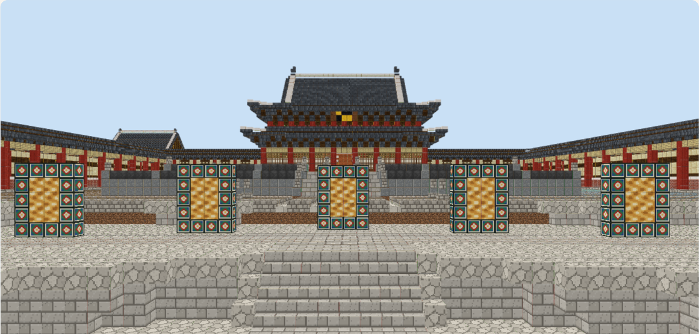

# 경복궁 어전대회

마인크래프트 교육용 에디션 미니게임 월드 **Wheel of Steve**(ReWrite Media)를 경복궁과 조선 초기 인물로 다시 꾸민 월드입니다. 게임 규칙은 원작과 같고, 진행자·배경·물건·블록·배경음악을 조선 문화에 맞게 바꿨습니다.

- **월드 내려받기**: [Gyeongbokgung-Royal-Tournament-v1.0.mcworld](https://github.com/ssakspirit/wheelofsteveGBG/releases/download/v1.0/Gyeongbokgung-Royal-Tournament-v1.0.mcworld) (약 43MB, [릴리스 v1.0](https://github.com/ssakspirit/wheelofsteveGBG/releases/tag/v1.0))
- **플레이어 안내 페이지**: <https://claude.ai/artifact/5nyhB1La5NPcbzxpJeV8cL>
  마당별 놀이 방법, 진행자, 배경이 된 경복궁, 물건과 동물, 배경음악 미리듣기, 선생님 진행 팁을 담았습니다.

## 설치

1. 위의 `.mcworld` 파일을 내려받습니다.
2. 파일을 두 번 클릭하면 마인크래프트 교육용 에디션이 새 월드로 들여옵니다.
3. 월드 목록에서 **경복궁 어전대회**를 엽니다.

## 대회

두 팀(붉은 옷 **홍포대**, 푸른 옷 **청포대**)이 팀마다 최대 4명, 모두 8명까지 함께합니다. 혼자서도 할 수 있습니다. 세종대왕 곁의 혼천의를 돌려 다섯 대결 가운데 하나를 뽑고, 3번 먼저 이긴 팀이 비밀 대결에 나갑니다.

| 마당 | 진행자 | 배경 |
|---|---|---|
| 옥새 쟁탈전 | 황희 | 경복궁 강녕전 자리 |
| 자격루 복원전 | 장영실 | 경회루 남쪽 수정전 자리 |
| 교태전 꽃담 맞추기 | 정도전 | 교태전 자리와 아미산 |
| 태조의 활쏘기 대회 | 태조 이성계 | 인왕산 기슭 활터 |
| 6진 망루 공성전 | 김종서 | 두만강 골짜기 |
| 백악산 엽전 달리기 (비밀 대결) | 세종대왕 | 백악산 눈 덮인 비탈 |

로비는 광화문에서 근정전까지 경복궁 전체를 옮겨 와 꾸몄습니다.

| 옥새 쟁탈전 | 자격루 복원전 | 교태전 꽃담 맞추기 |
|---|---|---|
|  |  |  |
| **태조의 활쏘기 대회** | **6진 망루 공성전** | **로비** |
|  |  |  |

그림은 개발용 3D 미리보기에서 찍은 장면이라 게임 안에서는 빛과 안개 때문에 조금 다르게 보입니다.

## 선생님께

- 월드에 **처음 들어온 사람이 호스트**가 됩니다. 호스트만 시작 버튼, 혼천의, 진행자를 쓸 수 있으니 선생님이나 진행할 학생이 먼저 들어가세요.
- 모두 팀을 고른 뒤 호스트가 황금 블록의 버튼을 누르면 시작합니다. 그 뒤로는 새로 들어올 수 없습니다.
- 경기에 참여하지 않고 지켜보려면 채팅에 `/function admin`을 입력합니다. 호스트는 관전자가 되면 안 됩니다.
- 호스트가 나가 모두 움직일 수 없으면 다른 사람이 `/function dev/host`로 호스트를 이어받습니다. `/function dev/status`로 지금 대결과 팀 승리 수를 볼 수 있습니다.
- 호스트가 진행자에게 말을 걸면 그 대결을 바로 해 볼 수 있습니다. 이렇게 한 대결은 승리 기록에 남지 않아 수업 전 연습에 좋습니다.

자세한 진행 팁은 [플레이어 안내 페이지](https://claude.ai/artifact/5nyhB1La5NPcbzxpJeV8cL)의 '선생님께'에 있습니다.

## 크레딧

- 원작: ReWrite Media의 마인크래프트 교육용 미니게임 월드 Wheel of Steve
- 경복궁 어전대회 리테마: 스티브코딩
- 배경음악: Google Flow Music으로 만든 곡
- 경복궁 건물: 경복궁을 블록으로 지은 월드에서 옮겨 왔습니다.

## 개발

이 저장소는 월드 폴더 그대로입니다. 행동 팩의 게임 규칙(`behavior_packs/bp0/`, `texts/` 제외)은 원작에서 바꾸지 않았고, `node tools/rule-guard.js`가 원작 기준(`baseline-rules` 태그)과 비교해 확인합니다. 그림·모델·소리·배경을 만드는 도구는 `tools/`에 있고, 작업 방법은 [CLAUDE.md](CLAUDE.md)에 정리되어 있습니다. 배포용 `.mcworld`는 `python tools/export-mcworld.py`로 만듭니다.
